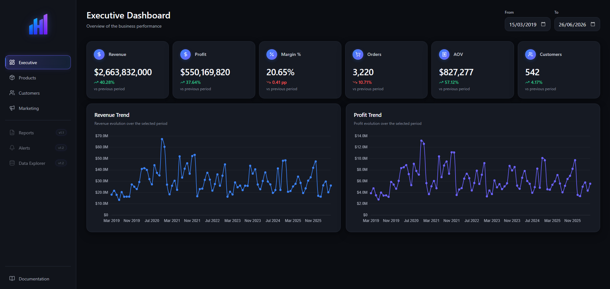
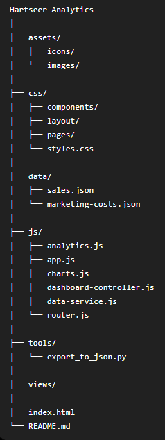
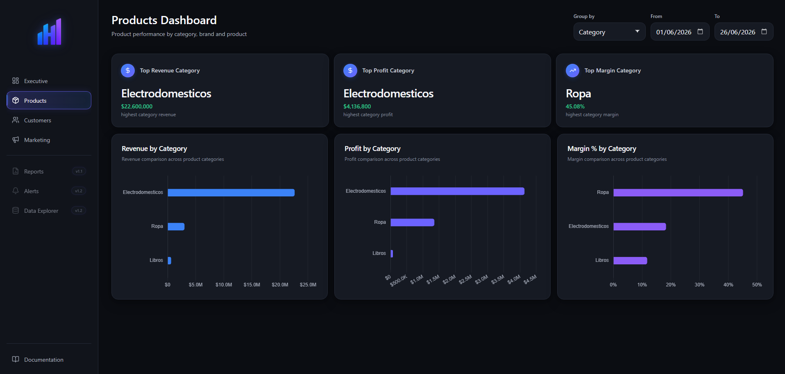
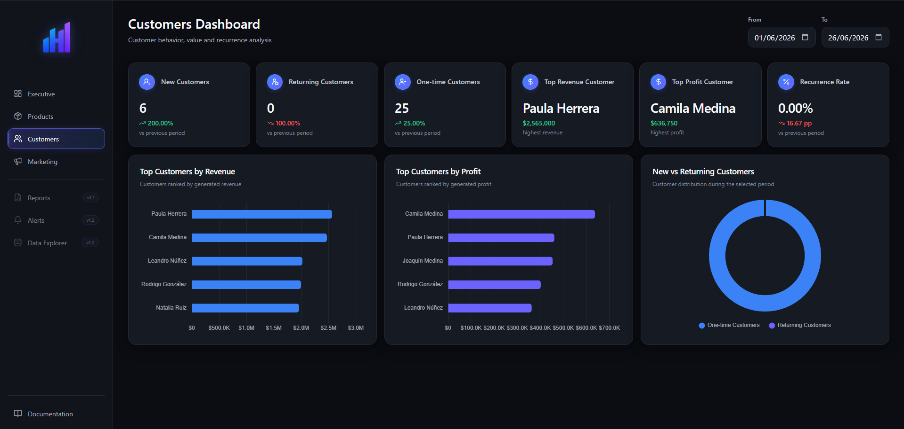
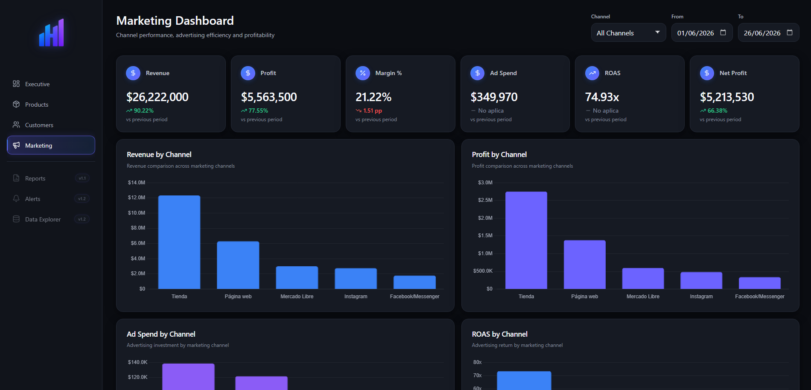

# Hartseer Analytics

### End-to-End Business Intelligence Platform for Retail Business Analysis

[🌐 Live Demo](https://franpaez.github.io/hartseer-analytics/) •
[📄 Documentation](analytics/documentation/Hartseer_Analytics_Documentation.pdf) •
[📘 Frontend Documentation](analytics/documentation/Hartseer_Frontend_Documentation.pdf) •
[🎨 Analytics Design](analytics/documentation/Hartseer_Desing_Analytics.pdf)

SQL • Power BI • MySQL • Python • FastAPI • JavaScript • Chart.js



---

## Overview

Hartseer Analytics is an end-to-end Business Intelligence project designed to analyze the performance of a fictional retail company.

The project combines relational database design, SQL analytics, Business Intelligence dashboards and a modular web application into a single analytical platform focused on supporting business decision-making.

Version 1.0 includes a production REST API that connects the analytical dashboards to MySQL through a FastAPI backend.

---

## Features

- Executive Dashboard
- Product Analytics
- Customer Analytics
- Marketing Analytics
- Interactive Date Filters
- Dynamic Product Grouping
- Dynamic Marketing Channel Filtering
- REST API Integration
- Live MySQL Data Access
- Modular SPA Architecture
- Business Storytelling Validation

---

## Technologies

| Layer | Technology |
|--------|------------|
| Database | MySQL |
| Backend | Python · FastAPI · Uvicorn |
| API | REST |
| Frontend | HTML5 · CSS3 · JavaScript |
| Architecture | SPA |
| Visualization | Chart.js |
| Business Intelligence | Power BI |
| Analytics | SQL |
| Deployment | Railway · GitHub Pages |

---

## Project Architecture



The current application follows a layered architecture:

```text
MySQL
  ↓
FastAPI REST API
  ↓
Frontend Data Service
  ↓
Dashboard Controller
  ↓
Dashboard Views
  ↓
Charts / UI
```

The frontend is deployed through GitHub Pages, while the backend API is deployed through Railway.

---

## API

The production API is versioned under `/api/v1`.

### Available Endpoints

| Endpoint | Purpose | Parameters |
|----------|---------|------------|
| `/api/v1/health` | API and database health check | — |
| `/api/v1/executive` | Executive dashboard data | `start_date`, `end_date` |
| `/api/v1/products` | Product analytics | `start_date`, `end_date`, `group_by` |
| `/api/v1/customers` | Customer analytics | `start_date`, `end_date` |
| `/api/v1/marketing` | Marketing analytics | `start_date`, `end_date`, `channel` |

The API returns standardized responses containing `success`, `data` and `meta` fields.

---

## Project Structure

```text
Hartseer Analytics
│
├── analytics/
│   └── documentation/
│
├── backend/
│   ├── app/
│   │   ├── controllers/
│   │   ├── core/
│   │   ├── database/
│   │   ├── repositories/
│   │   ├── routes/
│   │   ├── schemas/
│   │   └── services/
│   ├── .env.example
│   └── requirements.txt
│
├── frontend/
│   ├── assets/
│   ├── css/
│   │   └── styles.css
│   ├── js/
│   │   ├── analytics.js
│   │   ├── app.js
│   │   ├── charts.js
│   │   ├── dashboard-controller.js
│   │   ├── data-service.js
│   │   ├── router.js
│   │   └── views/
│   │       ├── executive.js
│   │       ├── products.js
│   │       ├── customers.js
│   │       └── marketing.js
│   └── index.html
│
├── .gitignore
└── README.md
```

---

## Dashboards

### Executive Dashboard


---

### Products Dashboard



---

### Customers Dashboard



---

### Marketing Dashboard



---

## Documentation

The project includes technical documentation covering the development process, analytical design and frontend implementation.

- 📄 **Hartseer Documentation**
  - Complete project development process.

- 📄 **Hartseer Analytics Design**
  - Business model, analytical design and storytelling.

- 📄 **Hartseer Frontend Documentation**
  - Frontend architecture, implementation and technical decisions.

---

## Roadmap

### Current Version

**v1.0**

- Complete SQL Database
- Business Intelligence Dashboards
- Production REST API
- MySQL Integration
- Frontend SPA
- Technical Documentation

---

### Planned

**v1.1**

- Reports Module

**v1.2**

- Alerts
- Data Explorer

---

## Current Scope

Version 1.0 provides an integrated analytical platform in which the frontend dashboards consume business data through the production REST API.

The backend exposes analytical endpoints through FastAPI, retrieves data from MySQL and returns standardized API responses to the frontend.

The current release covers Executive, Products, Customers and Marketing dashboards.

---

## Development Notes

Hartseer Analytics was developed as a personal learning project focused on strengthening practical skills in Data Analytics, SQL and Business Intelligence.

The business model, database design, dataset generation, storytelling, SQL development, Business Intelligence dashboards, technical documentation and functional product design were conceived and developed throughout the project.

Artificial Intelligence tools were used during the frontend implementation as a development assistant, accelerating the technical construction of the web application. Product decisions, dashboard organization, user experience, visual design and project evolution remained under my responsibility throughout the development process.

---

## License

This project is intended for educational and portfolio purposes.
